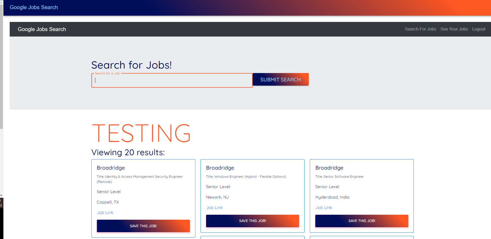

# fates


  ## Table of Contents
  -[Description](#description)
  -[Install](#install)
  -[Usage](#usage)
  -[Collaborators](#collaborators)
  -[Instructions](#instructions)
  -[Licenses](#licenses)
  -[Questions](#questions)

  ### Description
```
AS A recent Bootcamp Graduate
I WANT an app that allows me to search for new Job Listings 
SO THAT I can Apply to new Jobs in my field of choice 
So THAT I can save any jobs in my profile 
```


Here is a screenshot of the application 
[]

  ### Install
  Download this repo, run npm init, npm i, and then run on your local server using React. Run npm run develop from the root of the folder. This server runs on localhost:3000

  ### Usage
  View the deployed site using the link below:
    https://immense-ocean-63778.herokuapp.com/  

  ### Collaborators
   This application was made possible by the following people:

    https://github.com/rtleib 
    https://github.com/SipG789 
    https://github.com/mhmunter 

  ### Instructions

    The user can login to the website, search for a job posting, view up to 20 job listings and click on the link to the job site. Must use capital letter for first letter of each word.(Adobe, Broadridge, Northrop Grumman always have tech job posting)

  ### Licenses 
  Apache2.0

  ### Questions
  Feel free to contact us at:
  GitHub: "https://github.com/mhmunter/fates"

